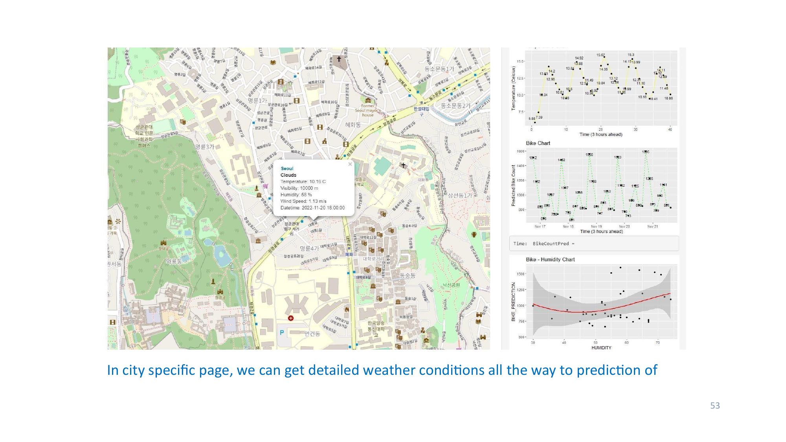

# 🚲 Predicting Bike-Sharing Demand from Weather Conditions

**Can weather data predict how many bikes a city will need?** This project answers that question using Seoul's bike-sharing system — combining demand data, live weather API feeds, and web-scraped global bike-system data into regression models and an interactive R Shiny dashboard.



## Business Problem
Bike-sharing operators face a costly balancing act: too few bikes and riders can't find one; too many and capital sits idle. Since weather strongly influences riders' decisions, a weather-driven demand forecast lets operators position supply efficiently and minimize cost.

## Data Sources
| Source | Method |
|---|---|
| Seoul Bike Sharing demand dataset | CSV (hourly rentals + weather) |
| OpenWeather API (current & forecast) | API key → R → data frame → CSV |
| World Cities dataset | CSV |
| Global bike-sharing systems | Web scraping with `rvest` |

## Methods
1. **Data wrangling** — `stringr` (regex) for standardizing column names and cleaning values; `dplyr` pipelines for missing data, dummy variables, and normalization.
2. **Exploratory analysis with SQL** (Db2) — record counts, operational hours, weather outlook, seasonal breakdowns, rental & weather seasonality, and merging Seoul with world-cities data to find comparable systems.
3. **Exploratory visualization** — `ggplot2`: distributions, correlations, outlier detection, seasonal patterns.
4. **Predictive modeling** — train/test split; baseline regression on all variables vs. weather-only models; polynomial terms, interaction terms, and regularization; models compared on **RMSE** and **R²**, validated with Q-Q plots.

## Key Findings
- 🌡️ **Temperature is the strongest driver** — average rentals rise with temperature; summer peaks, winter bottoms out. Peak demand hit **3,556 bikes** on June 19, 2018 at 6 PM.
- 🌧️ Top predictors: **rainfall, humidity, temperature, dew-point temperature** — plus evening hours.
- 🏙️ Seoul has roughly **1 bike per 1,000 residents**; most comparable systems are in China (Shanghai, Beijing).
- 📊 The tuned model (polynomial + interaction terms) predicts test-set demand closely, confirmed by Q-Q plot diagnostics.

## Interactive Dashboard (R Shiny)
Built with `shiny` + `leaflet`: a city map with live weather popups, temperature trend lines, bike-demand prediction trends, and prediction-vs-actual correlation plots — with a **city dropdown** to switch between global bike-sharing cities.

## Tools
`R` · `Shiny` · `leaflet` · `ggplot2` · `dplyr` · `stringr` · `rvest` · `SQL (Db2)` · OpenWeather API

## Repository Structure
```
├── assets/                        # Dashboard screenshots
├── report/                        # Full capstone report (92 pp.)
│   └── capstone-final-project-d.pdf
└── README.md
```

*Completed February 2024 as the capstone for IBM's Applied Data Science with R program.*
